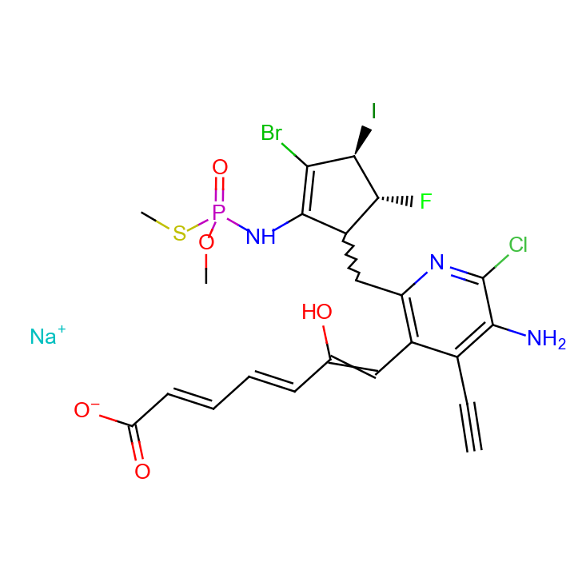

Chorus
===================================================

**Chorus** is a simple chemical structure modeling toolkit.


Installation
-------------

### PyPI

```
pip3 install chorus
```


### Anaconda

Distributing conda package is work in progress.

```
conda upgrade -n root conda
conda install -n root conda-build

conda skeleton pypi chorus
conda build chorus
conda install --use-local chorus
```


Features
----------

- Structure image export (PNG)
  

- Structure image export (SVG)
  

- Import from/export to .sdf, .mol
- Import from/export to RDKit molecule
- Molecular property calculation (MW, Chemical formula)
- Descriptors

  - H-bond donor/acceptor
  - Wildman-Crippen logP
  - Aromaticity

- Molecule graph topology (ring, scaffold, connectivity)
- Sub(super)structure search
- MCS with diameter restriction (MCS-DR) and graph-based local similarity (GLS)


Features (WIP)
-------------------------------

- Functional group descriptors
- Markush structue
- SMILES and 2D coordinate generation


Features (will never be implemented)
-------------------------------------

- Python 2 compatibility
- Fingerprint similarity
- And many of the features already available in RDKit


API Documentation
------------------------

https://mojaie.github.io/chorus


License
-------------

[MIT license](http://opensource.org/licenses/MIT)

See [chorus/resources/README.md](https://github.com/mojaie/chorus/tree/master/chorus/resources) for license details of sample dataset resources.


Copyright
--------------

(C) 2014-2017 Seiji Matsuoka
